<div align="center">

# SuperFriend

**智能 AI Agent 平台**

自定义 Skills · MCP 协议服务 · 安全沙箱 · 文档生成/解析 · 知识图谱 · 记忆宫殿

[](https://www.java.com/)
[](https://spring.io/projects/spring-boot)
[](https://vuejs.org/)
[](LICENSE)

</div>

---

SuperFriend 是一个基于 Spring Boot 的全栈 AI Agent 平台，支持自定义技能（Skills）、MCP 协议服务、安全沙箱执行，以及 Word/PPT/Excel/PDF 等文档的生成与解析。通过多模态对话、知识图谱、记忆宫殿、用户画像等能力，为用户提供强大的智能助手体验。

<p align="center">
  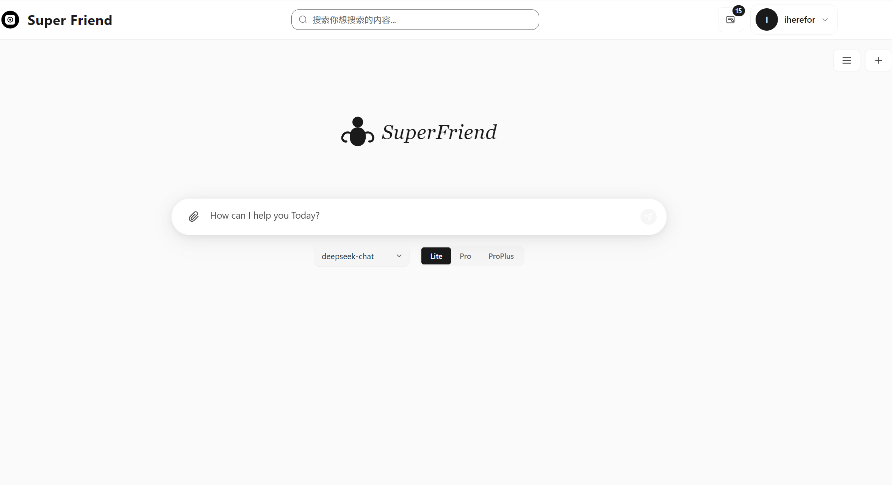
  <br>
  <em>SuperFriend 首页 — AI 对话与智能交互</em>
</p>

<p align="center">
  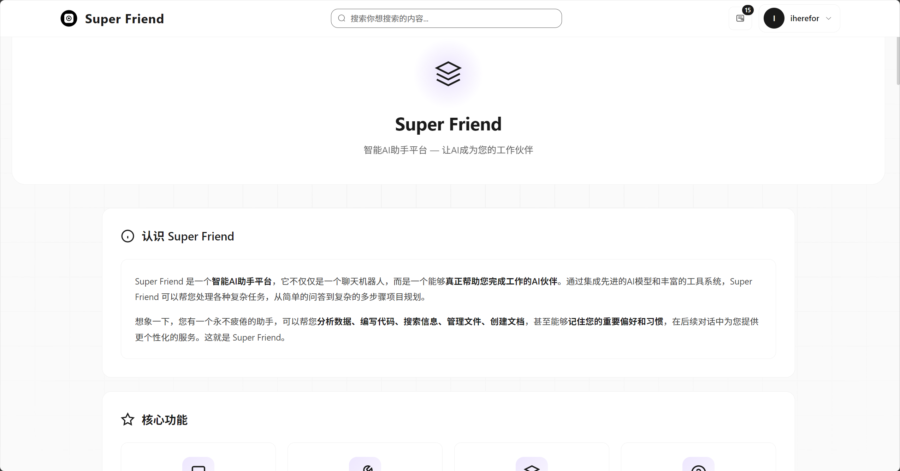
  <br>
  <em>项目介绍 — SuperFriend 功能概览</em>
</p>

---

## 功能架构

| 模块 | 核心能力 | 关键技术 |
|------|---------|---------|
| **Skills 系统** | 技能发现/加载/执行/编排/自定义 | Agent Skills 协议、渐进式加载、Hook 机制 |
| **MCP 服务** | 工具服务管理/调度/智能选择 | MCP 协议、动态配置、语义匹配 |
| **安全沙箱** | 命令过滤/资源限制/会话隔离 | 白名单+黑名单、ulimit、审计追踪 |
| **文档引擎** | Word/PPT/Excel/PDF 生成与解析 | OpenXML SDK、PptxGenJS、Apache POI/PDFBox |
| **AI 对话** | 多模型/流式响应/多模式/意图识别 | OpenAI API、SSE、Lite/Medium/Complex |
| **Agent 编排** | 任务规划/错误恢复/审批/权限 | TaskPlanner、Reflection、Approval |
| **知识图谱** | 节点/关系/上下文/语义搜索 | 知识提取、图精化、节点丰富 |
| **记忆宫殿** | 记忆创建/触发/检索/生命周期 | 触发分析、语义检索、衰减归档 |
| **LLM 监控** | 调用追踪/思考可视化/性能指标 | Langfuse/Arize、实时面板 |
| **可观测性** | 执行追踪/指标采集/外部上报 | ObservabilityService、AgentMetrics |

---

## 核心特性

### 1. 自定义 Skills 系统

SuperFriend 实现了完整的 [Agent Skills 协议](https://agentskills.io/specification)，兼容 Anthropic Skills、Pi Skills、OpenClaw Skills 等主流技能规范。

<p align="center">
  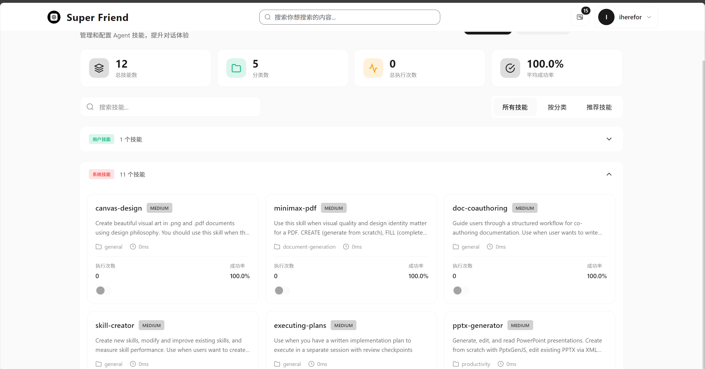
  <br>
  <em>Skills 管理 — 查看、创建、配置自定义技能</em>
</p>

<p align="center">
  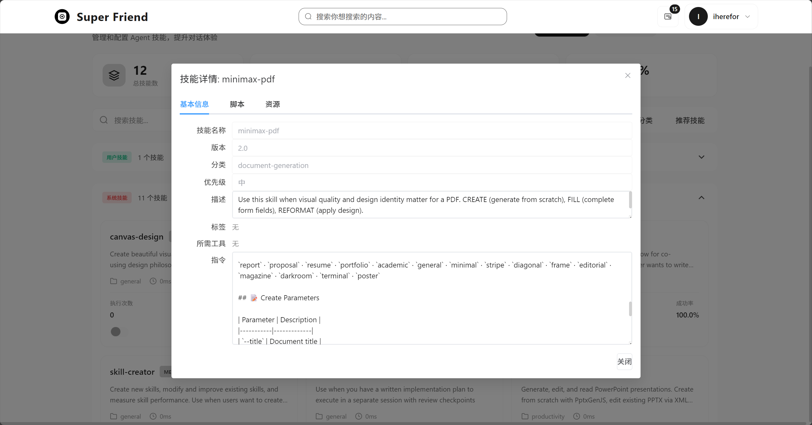
  <br>
  <em>Skills 详情 — 元数据展示与技能描述</em>
</p>

<p align="center">
  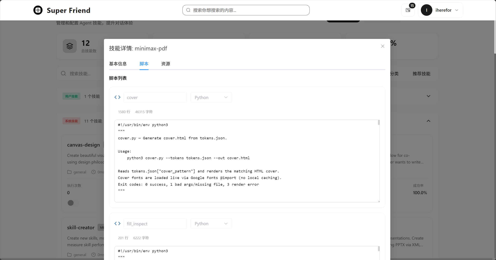
  <br>
  <em>Skills 脚本 — 技能执行脚本查看与编辑</em>
</p>

<p align="center">
  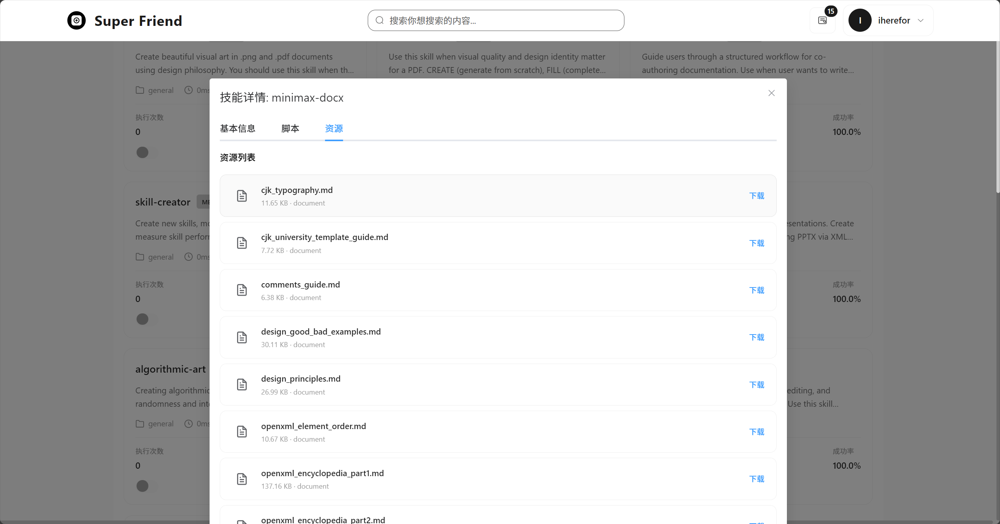
  <br>
  <em>Skills 资源文件 — 技能捆绑资源管理</em>
</p>

- **技能发现与加载**：启动时自动扫描 `skills/system/` 和 `skills/users/{user_id}/` 目录，解析 `SKILL.md` 元数据
- **渐进式加载**：三级加载策略 — 元数据（始终在上下文）→ SKILL.md 正文（触发时加载）→ 捆绑资源（按需加载）
- **技能执行器**：支持 `script`（脚本执行）和 `command`（命令模板）两种执行模式，兼容 Python / Node / Bash / .NET 运行时
- **技能激活分析**：`SkillRecommendationService` 基于关键词、上下文、描述的多维度权重评分，智能匹配用户意图
- **Hook 机制**：支持技能执行前后的钩子拦截（`SkillHook`），可扩展预处理和后处理逻辑
- **工作流编排**：`SkillWorkflow` 支持多步骤技能编排，`WorkflowExecutor` 负责顺序执行
- **用户自定义技能**：用户可通过 `skill-creator` 技能创建、测试、迭代自己的技能
- **技能环境管理**：`SkillEnvironmentManager` 管理技能运行时环境依赖

### 2. MCP 服务集成

SuperFriend 内置 MCP（Model Context Protocol）Host，统一管理和调度外部工具服务。

<p align="center">
  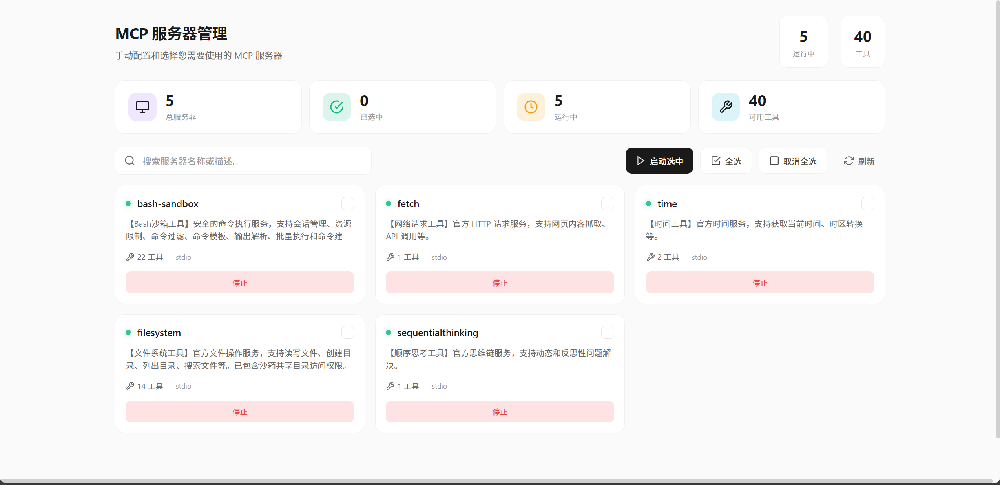
  <br>
  <em>MCP 服务器管理 — 配置、监控和管理 MCP 工具服务</em>
</p>

- **MCP Host 服务**：`McpHostService` 负责服务发现、生命周期管理、工具调用路由
- **内置 MCP 服务**：

  | 服务 | 说明 |
  |------|------|
  | `bash-sandbox` | 安全沙箱命令执行 |
  | `filesystem` | 文件系统操作（读写、搜索、目录管理） |
  | `sequential-thinking` | 顺序思考 / 思维链推理 |
  | `fetch` | HTTP 网络请求 / 网页抓取 |
  | `time` | 时间查询与时区转换 |
  | `shell-mcp-server` | 多 Shell 命令执行（Bash/PowerShell/CMD） |
  | `git` | Git 版本控制操作 |

- **动态配置**：通过 `mcp-servers-config.json` 配置 MCP 服务，支持环境变量替换、超时控制、启用/禁用
- **自动进程管理**：`McpServiceLauncher` 负责 MCP 服务进程的启动、监控和自动重启
- **工具智能选择**：`SemanticToolSelectionService` 根据语义匹配最优工具
- **降级策略**：`FallbackStrategyService` 工具调用失败时自动选择替代方案

### 3. 安全沙箱执行

沙箱系统为 AI Agent 提供安全的命令执行环境，防止危险操作。

- **双重命令过滤**：
  - **白名单**：仅允许文件操作、文本处理、开发工具、网络工具、系统查询等安全命令
  - **黑名单**：阻止文件系统破坏（`rm -rf /`）、权限提升（`sudo`）、网络攻击（`nmap`）等危险命令
- **资源限制**：动态计算 CPU 时间（10-120s）、内存（64MB-1GB）、文件大小（100MB）、进程数（64）等上限
- **会话隔离**：`SkillSandboxSessionManager` 为每个会话提供独立的工作目录和环境变量
- **审计追踪**：`AuditLogger` 记录所有命令执行，完整的可观测性
- **跨平台**：支持 Linux（ulimit 隔离）和 Windows（进程超时控制）
- **速率限制**：`RateLimiter` 防止命令洪泛
- **敏感环境变量保护**：`SensitiveEnvVars` 自动过滤敏感信息

### 4. 文档生成与解析

SuperFriend 提供完整的 Office 文档和 PDF 生成/解析能力，通过内置 Skills 实现。每种文档类型都支持从创建到编辑、验证的完整工作流。

#### Word 文档（DOCX）

基于 OpenXML SDK (.NET)，提供三条处理管线：

| 管线 | 场景 | 说明 |
|------|------|------|
| **Pipeline A: CREATE** | 从零创建 | 支持报告、信函、备忘录、学术论文等类型 |
| **Pipeline B: FILL-EDIT** | 编辑已有文档 | 文本替换、占位符填充、表格填充、章节增删 |
| **Pipeline C: FORMAT-APPLY** | 套用模板 | 纯样式覆盖 (Overlay) 或基于模板替换内容 (Base-Replace) |

**核心能力：**

- **创建**：CLI 命令或直接编写 C# 脚本，支持页面设置（A4/Letter/Legal/A3）、页眉页脚、目录（TOC）、页码
- **编辑**：`replace-text`（文本替换）、`fill-placeholders`（占位符填充）、`fill-table`（表格填充）、`insert-section`/`remove-section`（章节操作）
- **验证管线**：`merge-runs`（合并文本块）→ `validate --xsd`（XSD 结构验证）→ `validate --business`（业务规则验证），失败时自动修复重试
- **分析**：`analyze`（文档结构分析）、`diff`（差异对比）、`docx_preview.sh`（预览）
- **CJK 排版**：中文公文（GB/T 9704 标准）、大学论文模板、CJK 字体映射（字号体系）
- **13 套美学配方**：ModernCorporate、AcademicThesis、ChineseGovernment、IEEE Conference、ACM sigconf、APA 7th、MLA 9th、Chicago/Turabian、Springer LNCS、Nature、HBR 等，每个配方包含来自官方样式指南的精确参数
- **丰富的 C# 代码示例**：DocumentCreation、StyleSystem、CharacterFormatting、ParagraphFormatting、Table（含三线表/斑马纹）、HeaderFooter、Image、ListAndNumbering、FieldAndToc、FootnoteAndComment、TrackChanges 等 12 个示例模块

**关键规则：**

- OpenXML 元素顺序严格（`pPr` → runs，`tblPr` → `tblGrid` → `tr`，`body` 末尾必须为 `sectPr`）
- 字号换算：`w:sz` = 磅值 × 2（12pt → `sz="24"`），边距单位为 DXA（1 英寸 = 1440）
- 标题样式必须包含 `OutlineLevel`，否则 Word 导航面板和目录无法识别
- 套用模板时必须清除源文档的直接格式污染（`rPr`/`pPr`），仅保留 `pStyle` 引用

#### PowerPoint 演示文稿（PPTX）

基于 PptxGenJS + XML 工作流，支持完整的演示文稿生命周期。

**5 种幻灯片类型：**

| 类型 | 用途 |
|------|------|
| **Cover** | 封面页 — 标题、副标题、日期 |
| **TOC** | 目录页 — 议程/大纲概览 |
| **Section Divider** | 章节分隔页 — 过渡与主题切换 |
| **Content** | 内容页 — 图文、表格、图表、代码 |
| **Summary** | 总结页 — 关键要点回顾 |

**设计系统：**

- **尺寸**：10" × 5.625"（16:9 宽屏）
- **主题键**：`primary`（深色/标题）、`secondary`（辅助色）、`accent`（强调色）、`light`（浅色）、`bg`（背景色）
- **字体**：英文 Arial，中文 Microsoft YaHei
- **4 种风格配方**：Sharp（锐利）、Soft（柔和）、Rounded（圆润）、Pill（胶囊）
- **页码徽章**：除封面外所有页面必须包含（圆形/胶囊样式，位于右下角）

**核心能力：**

- **创建**：每个幻灯片独立 JS 模块（`slide-01.js`），`compile.js` 统一编译，支持并行生成
- **编辑**：XML 解包 → 编辑 → 重新打包，保留原始格式
- **读取**：通过 markitdown 提取演示文稿文本内容
- **图表**：支持 BAR、LINE、PIE、DOUGHNUT、SCATTER、BUBBLE、RADAR 等 7 种图表类型
- **形状**：RECTANGLE、OVAL、LINE、ROUNDED_RECTANGLE

#### Excel 电子表格（XLSX）

基于 XML 直接编辑工作流，保证零格式损失。

**5 种任务路由：**

| 任务 | 方法 | 说明 |
|------|------|------|
| **READ** | `xlsx_reader.py` + pandas | 结构发现与数据分析 |
| **CREATE** | XML 模板 | 复制最小模板 → 编辑 XML → `xlsx_pack.py` 打包 |
| **EDIT** | XML unpack → edit → pack | 不使用 openpyxl（避免破坏 VBA/透视表/迷你图） |
| **FIX** | 修复 `<f>` 节点 | 修复损坏的公式 |
| **VALIDATE** | `formula_check.py` | 静态公式验证 + LibreOffice 动态重算 |

**核心能力：**

- **读取/分析**：`xlsx_reader.py` 解析数据结构、公式、格式
- **编辑操作**：`xlsx_add_column.py`（添加列+公式）、`xlsx_insert_row.py`（插入行+自动更新 SUM）、`xlsx_shift_rows.py`（行移位）
- **公式优先**：所有计算单元格必须使用 Excel 公式，禁止硬编码数值
- **公式验证**：`formula_check.py` 检查公式正确性，支持 JSON/报告输出
- **编辑完整性**：输出必须包含与输入相同的 Sheet，仅修改指定单元格

**金融颜色标准：**

| 单元格角色 | 字体颜色 | 色值 |
|-----------|---------|------|
| 硬编码输入/假设 | 蓝色 | `0000FF` |
| 公式/计算结果 | 黑色 | `000000` |
| 跨表引用公式 | 绿色 | `00B050` |

#### PDF 文档

基于 token 化设计系统，颜色、排版、间距由文档类型派生并贯穿每一页，输出为印刷级品质。

**3 条处理管线：**

| 管线 | 场景 | 说明 |
|------|------|------|
| **CREATE** | 从零生成 | `palette.py` → `cover.py` → `render_cover.js` → `render_body.py` → `merge.py` |
| **FILL** | 填充表单 | `fill_inspect.py`（检查字段）→ `fill_write.py`（填写数据） |
| **REFORMAT** | 重新排版 | `reformat_parse.py` → 完整 CREATE 管线 |

**15+ 文档类型：**

| 类型 | 封面风格 | 视觉特征 |
|------|---------|---------|
| `report` | 全出血 | 深色背景 + 点阵网格 + Playfair Display |
| `proposal` | 分栏 | 左面板 + 右几何图形 + Syne |
| `resume` | 排版式 | 超大首词 + DM Serif Display |
| `portfolio` | 氛围感 | 近黑色 + 径向光晕 + Fraunces |
| `academic` | 排版式 | 浅色背景 + 经典衬线 + EB Garamond |
| `minimal` | 极简 | 白色 + 单条 8px 强调线 + Cormorant Garamond |
| `stripe` | 条纹 | 3 条粗水平色带 + Barlow Condensed |
| `diagonal` | 对角线 | SVG 斜切 + 深浅双色 + Montserrat |
| `editorial` | 编辑风 | 幽灵字母 + 全大写标题 + Bebas Neue |
| `magazine` | 杂志风 | 暖色奶油底 + 居中堆叠 + Playfair Display |
| `darkroom` | 暗房风 | 海军蓝底 + 灰度图 + Playfair Display |
| `terminal` | 终端风 | 近黑色 + 网格线 + 等宽字体 + 霓虹绿 |
| `poster` | 海报风 | 白色底 + 粗侧栏 + 超大标题 + Barlow Condensed |

**内容块类型：** `h1`/`h2`/`h3`、`body`、`bullet`/`numbered`、`callout`（强调框）、`table`（交替行着色）、`image`/`figure`、`code`（等宽代码块）、`math`（LaTeX 数学公式）、`chart`（柱状/折线/饼图）、`flowchart`（流程图）、`bibliography`（参考文献）、`divider`/`pagebreak`/`spacer`

**强调色智能选择：** 根据文档语义上下文自动推荐 — 法律/金融（深海军蓝）、医疗（青绿）、科技（钢蓝）、环保（森林绿）、创意（勃艮第红）、学术（深青）等

**表单填充：** 支持 text（文本）、checkbox（复选框）、dropdown（下拉）、radio（单选）四种字段类型

**重新排版：** 支持 `.md` / `.txt` / `.pdf` / `.json` 输入格式

#### 文件解析

`FileParseService` 统一协调多种文件解析器：

| 文件类型 | 解析器 | 技术方案 |
|---------|--------|---------|
| 图片 | `ImageParser` | 腾讯云 OCR 文字识别 |
| PDF | `PdfParser` | Apache PDFBox |
| Office (DOCX/XLSX/PPTX) | `OfficeParser` | Apache POI |
| 音频 | `AudioParser` | 腾讯云 ASR 语音识别 |
| 视频 | `VideoParser` | 视频帧提取 + 分析 |
| 文本 | `TextFileParser` | 编码检测 + 文本读取 |

---

## 其他功能

### AI 对话系统

- **多模型支持**：兼容 OpenAI API 格式，支持 GPT-4、GPT-4o、DeepSeek、Ollama 等多种模型
- **流式响应**：SSE（Server-Sent Events）实时推送对话内容
- **模型能力适配**：`ModelCapabilityService` 根据模型能力自动调整请求格式

**对话 API 接口（`ChatController`）：**

| 接口 | 方法 | 说明 |
|------|------|------|
| `/api/v16/chat/lite-task` | POST | 轻量对话，快速响应 |
| `/api/v16/chat/lite-task-multimodal` | POST | 轻量对话（多模态），支持图片输入 |
| `/api/v16/chat/medium-task` | POST | 中等任务，平衡速度与质量 |
| `/api/v16/chat/complex-task` | POST | 复杂任务，深度推理 + 工具调用 |
| `/api/v16/chat/mcp` | POST | MCP 智能对话，支持 MCP 工具调用 |
| `/api/v16/chat/cancel/{sessionId}` | POST | 取消正在执行的对话任务 |
| `/api/v16/chat/status/{sessionId}` | GET | 查询会话当前状态 |
| `/api/v16/chat/finalize/{sessionId}` | POST | 结束对话并触发记忆/知识提取 |
| `/api/v16/chat/extract/{sessionId}` | POST | 立即执行记忆/知识提取 |
| `/api/v16/chat/extraction-status/{sessionId}` | GET | 查询提取状态 |
| `/api/v16/chat/finalize/{sessionId}/force-extraction` | POST | 强制重新提取 |

**对话编排流程（`ChatOrchestrator`）：**

所有对话请求统一经过 `ChatOrchestrator.dispatch()` 编排，流程如下：

```
用户请求 → ChatController（SSE 响应）
         → ChatOrchestrator.dispatch()
           ├─ 1. 意图识别（UserIntentService）
           ├─ 2. 意图路由
           │   ├─ GENERATE_IMAGE/AUDIO/VIDEO → MultimodalProcessService
           │   ├─ GENERATE_DOCUMENT → ChatModeStrategy（Lite 自动升级到 Medium）
           │   ├─ PARSE_FILE/IMAGE/AUDIO/VIDEO → 文件解析 → 增强消息 → 对话
           │   ├─ MULTIMODAL_CHAT → executeMultimodalChat()
           │   └─ CHAT → executeChat()
           ├─ 3. 策略执行（ChatModeStrategy）
           └─ 4. 上下文保存 + 记忆提取
```

**策略模式（`ChatModeStrategy`）：**

三种聊天模式对应不同的策略实现，均支持普通对话、多模态对话和文件解析后对话：

| 方法 | 说明 |
|------|------|
| `executeChat()` | 普通文本对话 |
| `executeMultimodalChat()` | 多模态对话（图片/音频/视频输入） |
| `executeFileParsedChat()` | 文件解析后的增强对话 |

**自动模式升级**：当 Lite 模式下检测到 `GENERATE_DOCUMENT` 意图时，自动升级到 Medium 模式（文档生成需要工具调用能力）

**会话管理（`AgentSessionManager`）：**

| 会话状态 | 说明 |
|---------|------|
| `IDLE` | 空闲 |
| `EXECUTING` | 执行中 |
| `PAUSED` | 暂停 |
| `CANCELLED` | 已取消 |

- **中断模式**：支持 `CANCEL`（取消）和 `APPEND`（追加上下文）两种中断方式
- **超时清理**：自动清理超时的会话状态
- **并发安全**：基于 `ConcurrentHashMap` 的线程安全会话管理

**SSE 响应机制：**

- **连接管理**：`SSEContext` 线程安全地管理连接状态、内容累积和客户端断开检测
- **心跳检测**：`lastActivityTime` 追踪最后活动时间
- **安全发送**：客户端断开后自动跳过后续发送，避免 `IOException`
- **资源引用**：生成的图片/音频/视频/文件自动追加资源引用标记（`image:resourceId`、`audio:resourceId` 等）

**多模态请求（`AIChatRequest`）：**

| 字段 | 说明 |
|------|------|
| `message` | 文本消息（最大 32,000 字符） |
| `content` | 结构化多模态消息（与 message 互斥） |
| `images` | 图片 URL 列表（HTTP 或 base64） |
| `documents` | 文档 URL 列表（PDF/DOCX/PPTX/XLSX） |
| `audios` | 音频 URL 列表（MP3/WAV/M4A/FLAC） |
| `videos` | 视频 URL 列表（MP4/AVI/MOV/MKV） |
| `imageSize` | 图片生成尺寸（如 1024x1024） |
| `enableKnowledgeExtraction` | 是否启用知识提取（默认 false） |
| `historyMessages` | 历史消息（新格式，支持多模态） |

**响应类型（`AIChatResponse`）：**

| 类型 | 说明 |
|------|------|
| `result` | 正常文本/多模态结果 |
| `thinking` | 思考过程（推理模型） |
| `error` | 错误响应（含 errorType/errorSuggestion/retryable） |
| `file` | 文件响应（含 resourceId/fileName/fileType/fileSize） |

- **成本追踪**：每次响应附带 `cost`、`inputTokens`、`outputTokens`、`totalCost`、`totalTokens`
- **模型切换**：`ModelSwitchInfo` 记录模型自动切换信息（原始模型、实际模型、切换原因）
- **多模态内容**：`ResponseContent` 支持 text/image/audio/video/file 五种类型

**对话结束与记忆提取：**

- `finalize` 接口在用户关闭/切换对话时调用，触发记忆宫殿提取或延迟知识提取
- `extract` 接口支持前端传入对话内容立即提取
- `force-extraction` 接口忽略已完成标记，强制重新提取

### 意图识别系统

SuperFriend 实现了双层意图识别架构，确保用户请求被准确路由到最佳处理策略。

**识别流程：**

```
用户请求 → LLM 意图分类（优先）→ 置信度 ≥ 0.7？→ 使用 LLM 结果
                                    ↓ 否
                              关键词匹配（后备）→ 使用关键词结果
                                    ↓ 无匹配
                              默认为 CHAT
```

**LLM 意图分类（`LLMIntentClassifier`）：**

- 使用轻量级 LLM 快速分类，支持对话历史上下文感知
- 内置决策树 Prompt：文档上传 → PARSE_FILE、图片 + OCR → PARSE_IMAGE、图片 + 分析 → MULTIMODAL_CHAT 等
- 上下文感知：结合对话历史判断是"新任务"还是"对话延续"
- 会话状态感知：检测会话中是否已有文件上传，避免误判
- 缓存机制：30 分钟 TTL 缓存，避免重复分类
- 自动修正：无附件时 PARSE_* 意图自动修正为 CHAT

**关键词匹配（后备方案）：**

- 生成意图：图片（画/生成图片/绘制）、音频（朗读/语音合成）、视频（生成视频）、文档（写Word/Excel/PPT）
- 解析意图：文件解析、OCR 文字识别、ASR 语音转文字
- 多模态对话：上传图片/音频后让 AI 理解

**10 种意图类型：**

| 意图 | 说明 | 典型触发 |
|------|------|---------|
| `CHAT` | 普通文本对话 | 问答、闲聊、咨询 |
| `MULTIMODAL_CHAT` | 多模态对话 | 上传图片/音频后让 AI 理解 |
| `GENERATE_IMAGE` | 生成图片 | 画、绘制、生成图片 |
| `GENERATE_AUDIO` | 生成音频 | 朗读、语音合成 |
| `GENERATE_VIDEO` | 生成视频 | 生成视频、制作视频 |
| `GENERATE_DOCUMENT` | 生成文档 | 写 Word/Excel/PPT |
| `PARSE_FILE` | 解析文档 | 上传 PDF/DOCX/XLSX 后提问 |
| `PARSE_IMAGE` | 图片 OCR | 提取图片文字、识别图中文字 |
| `PARSE_AUDIO` | 音频转文字 | 语音转文字、转录 |
| `PARSE_VIDEO` | 视频解析 | 分析视频内容 |

**附加能力：**

- **联网搜索判断**：`needsSearch` 字段判断是否需要最新实时信息（时效性数据、实时行情 vs 通用知识）
- **提示词优化**：`optimizedPrompt` 将用户意图优化为更清晰的提示词
- **图片尺寸推断**：根据用途自动推荐尺寸（手机壁纸 720×1440、电脑壁纸 1440×720、海报 768×1344 等）

### 上下文管理系统

SuperFriend 实现了多层上下文管理策略，确保长对话中关键信息不丢失，同时控制 Token 消耗。

**系统提示词构建（`SystemContextBuilder`）：**

`SystemContextBuilder` 统一管理系统提示词的注入，按优先级组装各模块上下文：

| 优先级 | 模块 | 最大长度 | 说明 |
|--------|------|---------|------|
| 1 | 基础提示词 | — | 根据聊天模式（Lite/Medium/Complex）选择 |
| 2 | 对话摘要 | — | 从 `chat_compression` 表注入已压缩的对话摘要 |
| 3 | 记忆宫殿 | 1000 字符 | 从 `MemoryRetrievalService` 注入相关记忆 |
| 4 | 知识图谱 | 800 字符 | 从 `KnowledgeGraphService` 注入相关知识 |
| 5 | 技能目录 | 不限制 | 完整展示可用技能元数据 |
| 6 | 任务状态 | — | 注入当前进行中的 Agent 任务进度 |
| 7 | 会话文件 | — | 注入会话中已上传的文件索引 |
| 8 | 工具列表 | — | MCP 模式下展示可用工具 |

- **总长度限制**：32,000 字符（约 8,000 tokens），超出时截断并提示使用 `load_skill` 获取完整信息
- **可配置开关**：每个模块均可独立启用/禁用

**三级上下文压缩（`ContextCompressionService`）：**

| 级别 | 触发条件 | 策略 |
|------|---------|------|
| **L1** | ≤ 10,000 tokens | 不压缩，直接使用 |
| **L2** | > 10,000 tokens | 规则压缩：截断工具结果、移除冗余空消息 |
| **L3** | L2 后仍 > 12,000 tokens | LLM 摘要压缩：滑动窗口保留最近 9,000 tokens，旧消息由 LLM 生成摘要 |

**L2 规则压缩细节：**

- **工具结果动态截断**：根据工具类型设置不同最大长度
  - 搜索工具结果：5,000 字符
  - 文件内容：15,000 字符
  - 错误信息：5,000 字符（优先保留错误上下文）
  - 默认：5,000 字符
- **智能截断**：错误信息优先保留错误上下文（前后各 50 字符），多行内容按行截断
- **移除空消息**：过滤掉空内容的 assistant/tool 消息

**L3 LLM 摘要压缩细节：**

1. **滑动窗口**：从最新消息向前累加，保留最近 9,000 tokens 的消息
2. **旧消息摘要**：将窗口外的旧消息发送给 LLM 生成摘要
3. **关键工具结果保留**：提取旧消息中的重要工具结果，单独保留
4. **反思合并**：将多条反思消息合并为一条摘要
5. **消息重要性评分**：`calculateMessageImportance()` 基于角色权重、内容特征、时效性计算分数
   - user 消息：+10（含问号 +3，超 100 字 +2，含关键词 +5）
   - assistant 消息：+5（含工具调用 +3）
   - tool 消息：+2（含错误 +4）
   - 时效性加分：越新越高（最高 +5）

**上下文摘要（`ContextSummarizerService`）：**

- **步骤结果摘要**：提取关键句子（含结果/答案/数据/错误等关键词），保留开头和结尾部分
- **步骤上下文构建**：原始任务 + 已完成步骤摘要 + 当前步骤
- **关键数据提取**：URL、数字、日期、错误信息
- **多步骤合并**：总长度超限时按比例压缩每个步骤

**压缩消息读取（`ContextMangerService.getMessagesWithCompression`）：**

优先使用压缩后的消息：摘要消息 → 保留的关键工具结果 → 最近未压缩的消息

### Agent 编排

- **任务规划**：`TaskPlannerService` 将复杂任务分解为子任务，支持依赖管理和并行执行
- **增强执行器**：`AgentExecutionService` 按计划执行子任务，支持检查点和恢复
- **反思机制**：`ReflectionService` 对执行结果进行自我评估和纠正
- **错误恢复**：自动诊断错误并选择恢复策略
- **重试策略**：`RetryStrategy` 支持指数退避等重试模式
- **审批机制**：`ApprovalService` 对敏感操作进行人工审批
- **权限管理**：`PermissionService` 基于策略的细粒度权限控制
- **降级策略**：`FallbackStrategyService` 工具调用失败时自动选择替代方案

### 知识图谱

- **节点管理**：创建、更新、删除知识节点，支持语义搜索
- **关系管理**：节点间的关联关系，构建知识网络
- **知识提取**：`KnowledgeExtractorService` 从对话中自动提取知识，支持异步提取和去重
- **图精化**：`GraphRefinementService` 优化知识图谱结构
- **上下文生成**：根据对话自动提取和关联知识，生成上下文注入 LLM
- **节点丰富**：`NodeEnrichmentService` 自动补充节点元数据
- **对话图谱**：`ConversationGraphService` 管理对话与知识的关联

### 记忆宫殿

SuperFriend 的记忆宫殿系统模拟人类记忆机制，实现从对话中智能提取、存储、检索和遗忘记忆的完整生命周期。

**记忆类型与衰减模型：**

| 类型 | 衰减率 | 时间单位 | 说明 |
|------|--------|---------|------|
| `CORE` | 0% | 永不衰减 | 用户显式要求记住的信息 |
| `IMPORTANT` | 2%/月 | 月 | 偏好、技能、重要决策 |
| `NORMAL` | 5%/周 | 周 | 知识点、一般事实 |
| `EPHEMERAL` | 10%/天 | 天 | 临时性信息 |

**有效分数计算：**

```
有效分数 = 置信度 × 衰减因子 × 强化因子

衰减因子 = (1 - 衰减率)^时间单位数
强化因子 = min(1.0 + 强化次数 × 0.15, 2.0)  // 每次强化 +15%，最高 200%
```

- 有效分数 ≥ 0.9 → 自动升级（EPHEMERAL → NORMAL → IMPORTANT → CORE）
- 有效分数 < 0.10 → 自动归档（每天凌晨 3:00 定时清理）
- 核心记忆永不衰减，衰减因子恒为 1.0

**记忆分类：**

| 分类 | 说明 | 触发词示例 |
|------|------|-----------|
| `PREFERENCE` | 用户偏好 | 我喜欢/我讨厌/我偏好/我习惯 |
| `SKILL` | 技能水平 | 我会/我能/我擅长/我精通 |
| `DECISION` | 重要决策 | 我决定/我选择/我定了/我打算 |
| `FACT` | 知识事实 | 什么是/怎么/如何/为什么 |
| `EXPERIENCE` | 经历体验 | 其他有价值的对话内容 |
| `RELATION` | 人际关系 | 关系相关的信息 |

**触发分析（`MemoryTriggerAnalyzer`）：**

9 层优先级检测，避免频繁提取垃圾信息：

1. **临时性信息排除**：短消息含"现在/今天/暂时"等 → 不记忆
2. **通用常识排除**：纯问候语、过短消息 → 不记忆
3. **显式触发**：含"记住/别忘了/记得" → CORE 类型，重要性 9
4. **偏好表达**：含"我喜欢/我讨厌/我偏好" → IMPORTANT 类型，重要性 7
5. **重要决策**：含"我决定/我选择/我定了" → IMPORTANT 类型，重要性 8
6. **技能表达**：含"我会/我能/我擅长" → IMPORTANT 类型，重要性 7
7. **知识询问**：含"什么是/怎么/为什么" + 有价值答案 → NORMAL 类型，重要性 6
8. **情感强度**：情感词 + 感叹号强度 > 0.7 → NORMAL 类型
9. **实体重要性**：含专有名词（书名号/引号）或回复超 500 字 → NORMAL 类型

**记忆检索（`MemoryRetrievalService`）：**

多维度相关性评分，优先返回高价值记忆：

- **关键词匹配**：标题 + 内容 + 关键词匹配，每匹配 +0.2
- **有效分数权重**：+0.3 × 有效分数
- **类型权重**：CORE +0.5 > IMPORTANT +0.3 > NORMAL +0.1
- **时效性权重**：7 天内 +0.1，30 天内 +0.05
- **访问频率权重**：每次访问 +0.01（上限 +0.1）

检索结果按类型分组注入 LLM 上下文：核心记忆（表格）、重要记忆（表格）、普通记忆（列表）

**记忆生命周期事件：**

| 事件 | 说明 |
|------|------|
| `CREATE` | 记忆创建 |
| `ACCESS` | 记忆被访问（+0.02 有效分数） |
| `REINFORCE` | 记忆被强化（+15% 强化因子） |
| `UPGRADE` | 类型升级 |
| `DOWNGRADE` | 类型降级 |
| `ARCHIVE` | 归档（有效分数过低） |
| `DELETE` | 软删除 |

**重复检测**：基于编辑距离计算标题相似度，> 0.85 判定为重复，重复时强化已有记忆而非创建新记忆

### 多模态支持

- **图片生成**：`GenericImageGenerator` 支持多种图片生成模型
- **视频生成**：`GenericVideoGenerator` 视频内容生成
- **音频生成**：`GenericAudioGenerator` / `ZhipuAudioGenerator` 音频内容生成
- **文件上传**：支持多文件上传，`MultimodalProcessService` 自动解析内容注入对话上下文
- **内容存储**：`MultimodalContentStorageService` 管理多模态内容的持久化

### 费用追踪

- **模型定价**：内置主流模型定价表，支持自定义定价
- **实时统计**：`CostTrackingService` 按会话、用户、日期维度统计 Token 用量和费用
- **Token 计数**：`TokenCountingService` 精确计算 Token 消耗
- **SSE 推送**：费用变化实时推送到前端

### LLM 监控

<p align="center">
  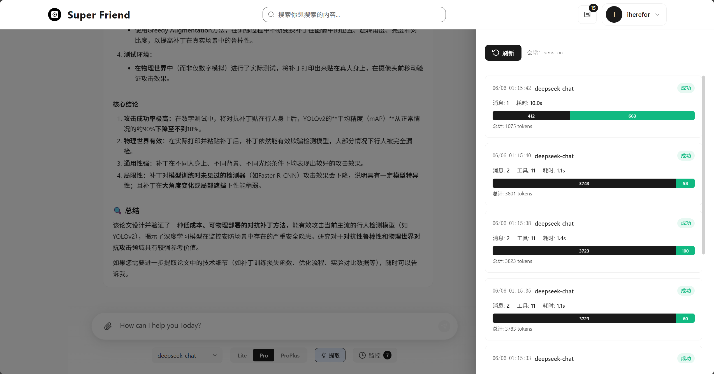
  <br>
  <em>LLM 调用追踪 — 实时监控大模型调用状态与延迟</em>
</p>

- **调用记录**：`LLMCallMonitorService` 记录每次 LLM 调用的详细信息
- **监控面板**：前端实时展示 LLM 调用状态、延迟、Token 消耗

<p align="center">
  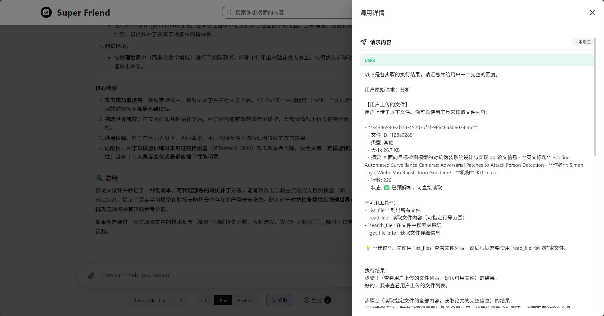
  <br>
  <em>思考过程展示 — 可视化大模型推理链与思维过程</em>
</p>

<p align="center">
  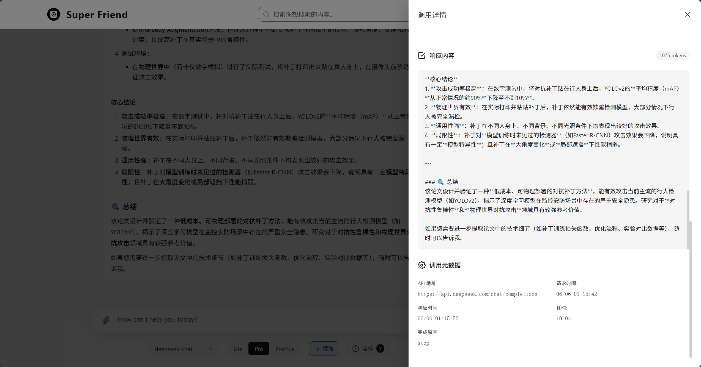
  <br>
  <em>思考记录与输出 — 完整展示大模型思考记录和最终回答</em>
</p>

### 模型配置

<p align="center">
  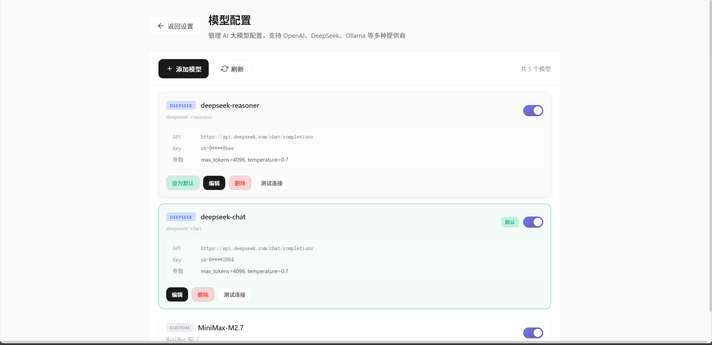
  <br>
  <em>模型配置 — 管理 OpenAI / DeepSeek / Ollama 等多种 AI 模型</em>
</p>

- **多模型管理**：`AIModelConfigService` 支持添加、编辑、测试多种 AI 模型配置
- **Embedding 模型**：`EmbeddingModelConfigService` 独立管理向量嵌入模型
- **模型能力检测**：`ModelCapabilityService` 自动识别模型支持的功能（视觉、函数调用等）

### 用户画像

<p align="center">
  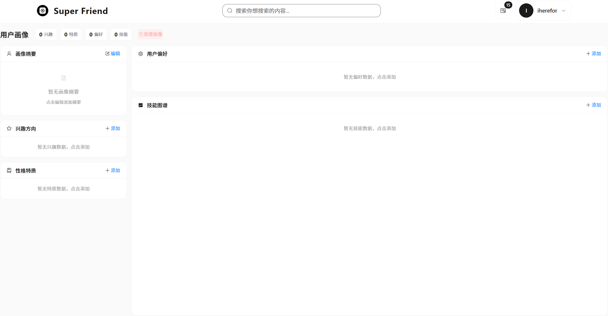
  <br>
  <em>用户画像 — 个性化用户偏好与使用习惯分析</em>
</p>

- **画像构建**：`UserProfileService` 基于对话历史自动构建用户画像
- **兴趣追踪**：记录用户兴趣领域，置信度动态调整（时间衰减 + 交互增强）
- **性格特征**：分析用户沟通风格和偏好
- **技能偏好**：追踪用户常用技能和使用模式

### 每日新闻

<p align="center">
  
  <br>
  <em>每日新闻 — AI 智能摘要与资讯推送</em>
</p>

- **新闻聚合**：`TencentNewsCacheService` 缓存热点新闻，支持 OrioSearch / TianAPI 数据源
- **智能搜索**：`OrioSearchService` 提供实时网络搜索能力
- **百科查询**：`BaiduBaikeService` 集成百科知识查询

### 设置中心

<p align="center">
  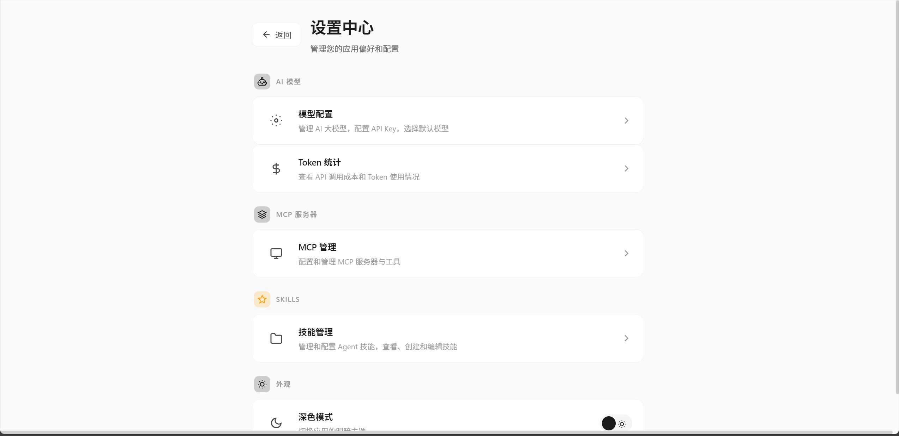
  <br>
  <em>设置中心 — 系统偏好与个性化配置</em>
</p>

### 可观测性

- **执行追踪**：`ExecutionTraceService` 记录完整的 Agent 执行链路
- **指标采集**：`AgentMetricsService` 收集执行次数、成功率、Token 消耗、工具调用等指标
- **外部上报**：`ObservabilityService` 支持 Langfuse 和 Arize 平台集成
- **检查点**：`ExecutionCheckpointService` 保存执行状态，支持恢复

### 系统内置 Skills

| 技能 | 说明 |
|------|------|
| `minimax-docx` | Word 文档创建、编辑、排版（OpenXML SDK） |
| `minimax-xlsx` | Excel 电子表格创建、编辑、分析 |
| `minimax-pdf` | PDF 文档生成、表单填充、重新排版 |
| `pptx-generator` | PowerPoint 演示文稿生成与编辑 |
| `skill-creator` | 创建、测试、迭代自定义技能 |
| `brainstorming` | 协作式头脑风暴与设计 |
| `doc-coauthoring` | 文档协作撰写工作流 |
| `executing-plans` | 计划执行与任务管理 |
| `canvas-design` | 视觉艺术与海报设计 |
| `algorithmic-art` | p5.js 生成艺术创作 |
| `brand-guidelines` | 品牌色彩与排版规范应用 |

### 用户认证与安全

- **JWT 认证**：`JwtService` 基于 JWT Token 的用户认证体系
- **BCrypt 加密**：`AuthService` 密码使用 BCrypt 安全哈希
- **登录日志**：记录用户登录行为，安全审计
- **CORS 配置**：跨域请求安全控制

---

## 技术栈

### 后端

| 类别 | 技术 |
|------|------|
| 框架 | Spring Boot 2.7.18 + Java 8 |
| 数据库 | MySQL + MyBatis + Spring Data JDBC |
| 文档解析 | Apache POI 5.2.5 + Apache PDFBox 2.0.30 |
| 云服务 | 阿里云 OSS、腾讯云 COS/OCR/ASR |
| API 文档 | Springdoc OpenAPI (Swagger) |
| 监控 | Spring Boot Actuator + Micrometer + Langfuse + Arize |

### 前端

| 类别 | 技术 |
|------|------|
| 框架 | Vue 3 + TypeScript + Vite |
| UI | Element Plus |
| 状态管理 | Pinia |
| 国际化 | vue-i18n（中/英） |
| 特色组件 | 流式文本渲染、LLM 监控面板、技能管理器、MCP 服务管理器、知识图谱可视化 |

### MCP 服务

| 服务 | 技术栈 |
|------|--------|
| bash-sandbox | TypeScript + Node.js |
| shell-mcp-server | Python |
| official-servers | Python（fetch / git / time） |

---

## 项目结构

```
SuperFriend/
├── src/main/
│   ├── java/com/superfriend/superfriend/
│   │   ├── agent/                    # Agent 核心
│   │   │   ├── config/               # 动态配置管理
│   │   │   ├── context/              # 上下文压缩策略
│   │   │   ├── error/                # 错误诊断与恢复
│   │   │   ├── executor/             # 工具执行器
│   │   │   ├── orchestration/        # Agent 事件编排
│   │   │   ├── planner/              # 任务规划与分解
│   │   │   ├── reasoning/            # 推理链
│   │   │   ├── retry/                # 重试策略
│   │   │   ├── skill/                # 技能系统核心
│   │   │   └── tool/                 # 工具注册与选择
│   │   ├── config/                   # Spring 配置
│   │   ├── controller/               # REST 控制器
│   │   ├── dto/                      # 数据传输对象
│   │   ├── entity/                   # 数据库实体
│   │   ├── generator/                # 多模态内容生成
│   │   ├── mapper/                   # MyBatis 数据访问
│   │   ├── parser/                   # 文件解析器
│   │   ├── service/                  # 业务服务层
│   │   └── strategy/                 # 聊天模式策略
│   └── resources/
│       ├── mcp-servers/              # MCP 服务实现
│       │   ├── bash-sandbox/         # 沙箱服务 (TypeScript)
│       │   ├── shell-mcp-server/     # Shell 服务 (Python)
│       │   └── official-servers/     # 官方 MCP 服务
│       ├── mcpserverconfig/          # MCP 配置文件
│       ├── python_scripts/           # Python 工具脚本
│       ├── skills/system/            # 系统内置技能
│       └── application.yml           # 应用配置
├── ui/                               # Vue 3 前端
│   └── src/
│       ├── api/                      # API 接口
│       ├── components/               # 组件
│       ├── composables/              # 组合式函数
│       ├── stores/                   # Pinia 状态
│       ├── views/                    # 页面视图
│       └── utils/                    # 工具函数
├── screenshots/                      # 界面截图
└── docs/                             # 项目文档
```

---

## 快速开始

### 环境要求

- Java 8+
- Node.js 18+
- Python 3.8+
- MySQL 8.0+
- .NET 8.0 SDK（DOCX 技能需要）

### 后端启动

```bash
# 配置数据库
# 修改 src/main/resources/application.yml 中的数据库连接信息

# 启动应用
./mvnw spring-boot:run
```

### 前端启动

```bash
cd ui
npm install
npm run dev
```

### MCP 服务构建

```bash
# 构建 bash-sandbox
cd src/main/resources/mcp-servers/bash-sandbox
npm install && npm run build
```

---

## License

MIT
